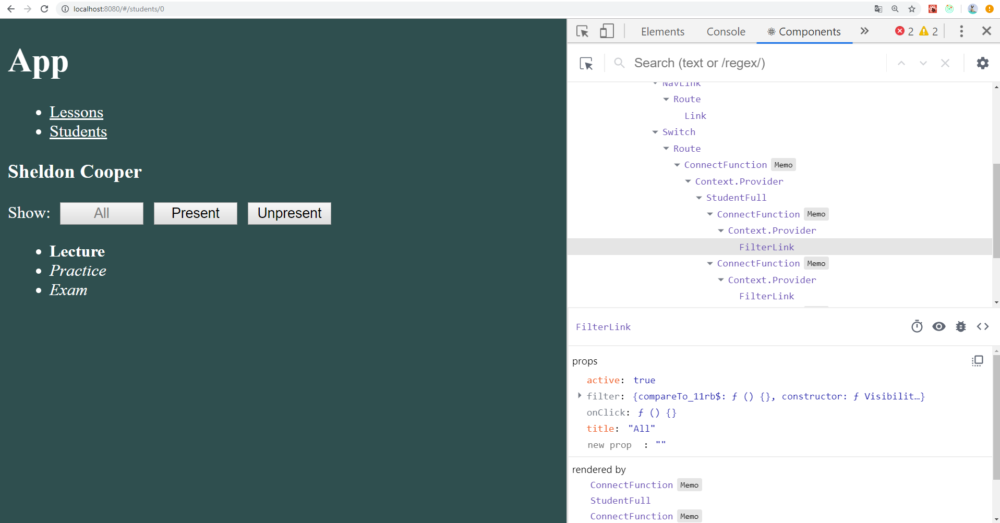
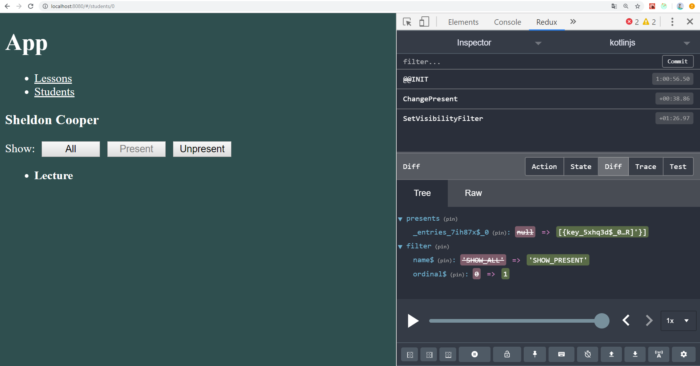
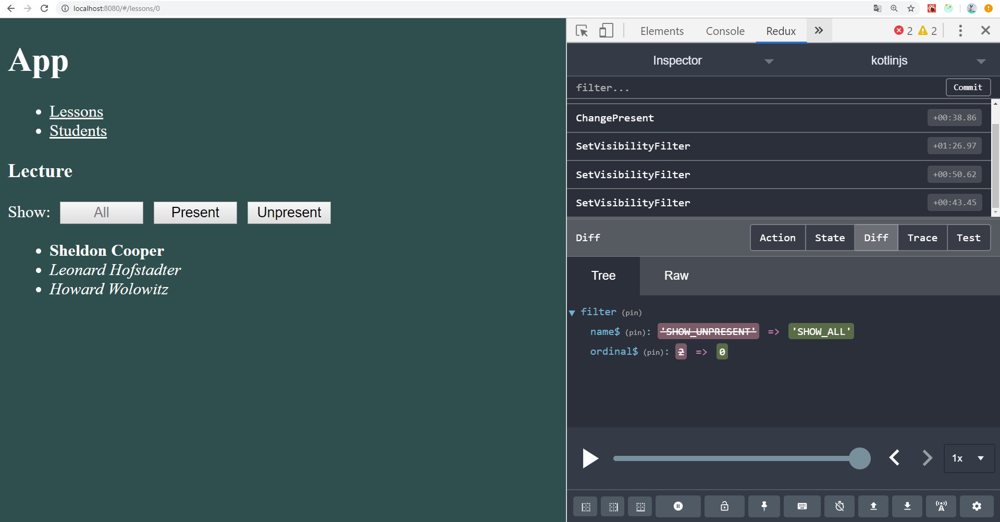
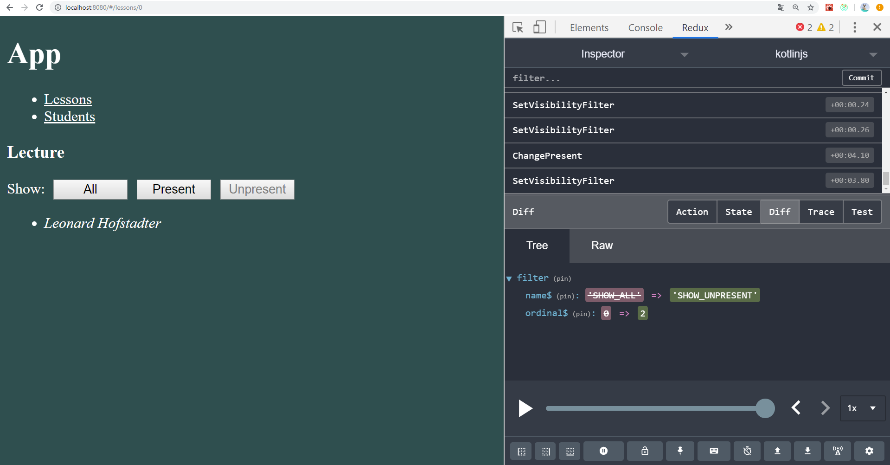

# KotlinJS 3.4
---
Взаимодействие React и Redux
-----------------------------------
__Задание:__ доработайте [приложение](https://github.com/AltmanEA/kotlinjs/tree/2ef20e09a6e5db7d48f7b8d794d048a2e4a29267), добавив в списки фильтры, которые выводят либо всех студентов (уроки), либо только присутствующих, либо только отсутствующих. Идеи для реализации такого фильтра можно задействовать из [этого](https://github.com/lawik123/kotlin-poc-frontend-react-redux) проекта.

Пусть фильтр будет иметь три состояния: SHOW_ALL (показать всех), SHOW_PRESENT (показать присутствующих), SHOW_UNPRESENT (показать отсутствующих).
Создадим для этих целей enum class:
```
enum class VisibilityFilter {
    SHOW_ALL,
    SHOW_PRESENT,
    SHOW_UNPRESENT
}
```
Состояние фильтрации будет хранится в хранилище Redux. Для этого добавим в State свойство filter и допишем начальное значение в initialState: 
 ```
class State(
    val lessons: LessonState,
    val students: StudentState,
    val presents: Presents,
    val filter: VisibilityFilter
)

fun initialState() =
    State(
        lessonsList().mapIndexed { index, lesson ->
            index to lesson
        }.toMap(),
        studentList().mapIndexed { index, student ->
            index to student
        }.toMap(),
        lessonsList().mapIndexed { idLesson, _ ->
            idLesson to studentList().mapIndexed { idStudent, _ ->
                idStudent to false
            }.toMap()
        }.toMap(),
        VisibilityFilter.SHOW_ALL
 ```

Для изменения состояния filter добавим новый Action и Reducer:
```
class SetVisibilityFilter(val filter: VisibilityFilter) : RAction

fun filterReducer(state: VisibilityFilter = VisibilityFilter.SHOW_ALL, action: RAction) =
    when (action) {
        is SetVisibilityFilter -> action.filter
        else -> state
    }
```

Для реализации фильтрации создадим новый компонент Link, который будет отвечать за отображение и изменении фильтра. Благодаря, свойству active можно понять является ли текущий фильтр выбранным. Функция onClick меняет состояние filter на фильтр за который отвечает компонент.
```
interface LinkProps : RProps {
    var title: String
    var active: Boolean
    var onClick: (Event) -> Unit
}

val fLink =
    functionalComponent<LinkProps> {
        button {
            attrs.onClickFunction = it.onClick
            attrs.disabled = it.active
            +it.title
        }
    }
```

Обернем наш новый компонент в контейнер, который обеспечит корректурную передачу свойств в компонент, назовем его filterLinkContainer:
```
interface FilterLinkOwnProps : RProps {
    var title: String  // title - название фильтра
    var filter: VisibilityFilter // filter - фильтр за который отвечает компонента
}

private interface LinkStateProps : RProps {
    var title: String // title - название фильтра
    var active: Boolean // active - выбран ли фильтр? true - да, false - нет
}

private interface LinkDispatchProps : RProps {
    var onClick: (Event) -> Unit // onClick - функция обратного вызова для изменения состояние filter в State
}

val filterLinkContainer =
    rConnect<
            State,
            SetVisibilityFilter,
            WrapperAction,
            FilterLinkOwnProps,
            LinkStateProps,
            LinkDispatchProps,
            LinkProps>(
        { state, ownProps ->
            title = ownProps.title
            active = state.filter == ownProps.filter
        },
        { dispatch, ownProps ->
            onClick = { dispatch(SetVisibilityFilter(ownProps.filter)) }
        }
    ) (
        withDisplayName(
            "FilterLink",
            fLink
        ).unsafeCast<RClass<LinkProps>>()
    )
```

Добавим несколько таких компонентов с разными фильтрами в anyFullContainer:
```
span { +"Show: " }
filterLinkContainer {
    attrs.title = "All"
    attrs.filter = VisibilityFilter.SHOW_ALL
}
filterLinkContainer {
    attrs.title = "Present"
    attrs.filter = VisibilityFilter.SHOW_PRESENT
}
filterLinkContainer {
    attrs.title = "Unpresent"
    attrs.filter = VisibilityFilter.SHOW_UNPRESENT
}
```
Добавим новую функцию getVisibleAny, которая в зависимости от выбранного фильтра будет фильтровать ассоциативный список объектов:
```
private fun <O> getVisibleAny(objects: Map<Int, O>, presents: Map<Int, Boolean>?, filter: VisibilityFilter): Map<Int, O> = when (filter) {
    VisibilityFilter.SHOW_ALL -> objects
    VisibilityFilter.SHOW_PRESENT -> objects.filter {
        presents?.get(it.key) ?: false
    }
    VisibilityFilter.SHOW_UNPRESENT -> objects.filter {
        !(presents?.get(it.key) ?: true)
    }
}
```
Воспользуемся функцией в studentFullContainer и lessonFullContainer для фильтрации subjects:
```
subobjs = getVisibleAny(state.students, state.presents[ownProps.obj.first], state.filter)
...
subobjs = getVisibleAny(state.lessons, state.presentsStudent(ownProps.obj.first), state.filter)
```
### Проверим работоспособность программы:

### 1. Внешний вид приложения и новый компонент для фильтрации

### 2. Отфильтруем занятия по присутствию студента

### 3. Отфильтруем занятия по отсутствию студента

### 4. Проверим "Lecture" на присутствие студентов

### 5. Отметим "Howard Wolowitz" как присутствующего и посмотрим отсутствующих
