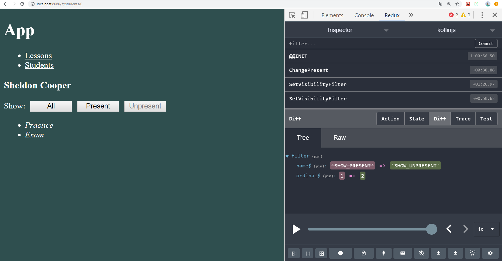

# KotlinJS 3.4
---
Взаимодействие React и Redux
-----------------------------------
### 1. Внешний вид приложения и новый компонент для фильтрации

### 2. Отфильтруем занятия по присутствию студента

### 3. Отфильтруем занятия по отсутствию студента

### 4. Проверим "Lecture" на присутствие студентов

### 5. Отметим "Howard Wolowitz" как присутствующего и посмотрим отсутствующих
